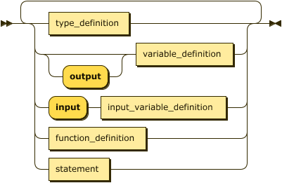
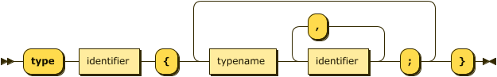
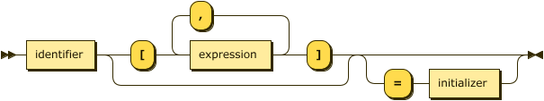

#  

# WT\*: an SIMD algorithm design framework

WT\* is a framework to study and teach the design of SIMD parallel algorithms. It's
based on the ideas of [Uzi Vishkin](https://dblp.uni-trier.de/pers/hd/v/Vishkin:Uzi),
used also in the book [JáJá: Introduction to Parallel Algorithms](https://www.amazon.com/Introduction-Parallel-Algorithms-Joseph-JaJa/dp/0201548569/ref=sr_1_1).
The aim of WT\* is to provide a hardware-independent programmer-friendly language which,
at the same time, captures essential properties of parallel programs, and can be relatively easily mapped to existing hardware-supported languages.

The structure of this document is as follows:

1. [Description of the language](#language)
    * [Types](#types)
    * [Variables](#variables)
    * [Input and output](#io)
2. Command line tools

## The language 

The WT\* provides a simple imperative strongly typed language, with a C-like syntax.

The programming model consists of a number of threads. The program is started with
one thread, and other threads can be dynamically created and terminated, forming a tree-like
structure of parent-child threads. All threads operate synchronously: they share 
a common code with a single PC (program counter) register. At each instant some group
of threads is *active* and they perform the current operation. 
Each thread can have its own local variables, and can also access all variables of its 
ancestors.

The complexity 
is measured in terms of *time* (the number of consecutive steps) and *work* (the overall number of instructions performed by all active threads).

The program is a sequence of type definitions, variable definitions, function definitions,
and statements.

### Types 

There are four basic types: `int`, `float`, `char`, and `void`. User defined types 
(a.k.a. structs, or records) can be created with the `type` keyword by combining
basic and user defined types:

so e.g. this is a valid code:

    type point {
      float x,y;
    } 

    type my_type {
      point p;
      int tag;
    }

### Variables and arrays 

Variables are declared by specifying the type:

The *variable declarator* is in the simplest form the name of the variable, e.g.
`my_type quak;`. The language supports multidimensional arrays. The size of each
dimension 
must be specified in the declaration. So, e.g. `int B[n,n*n];` declares a 2-dimensional
array `B`.

Finally, a variable can be assigned to during the declaration. The full variable declaration
syntax is as follows:

With severeal active threads, the variable declaration creates a separate copy of
the variable in each active thread.

### Input and output 

The input and output is handled by input/output variables. Any variable definition can be 
preceded by the keyword `output` which means the variable is meant to be part of the output. 
The runtime environment is responsible for displaying the output variables. The simplest way 
is to list all the values of the output variables in the order that appears in the source file.

Similarly, the input of data is handled by prefixing a variable definition by a keyword 
`input` (at most one of the `input` `output` keywords may be present). Again, the runtime 
environment is responsible for reading the data and initializing the variables. For
obvious reasons, input variables don't support initializers.

A caveat with input arrays is that the size of the array is not known in compile time.
Instead of the size expression, the input arrays use the *don't care* symbol (`_`).
Following is a simple program that reads an array and returns its size:

    input int A[_];
    output int x = A.size;

.    

