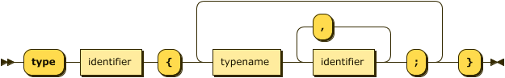
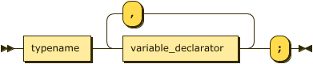
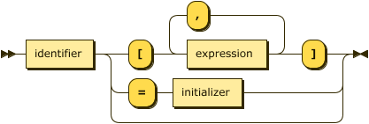
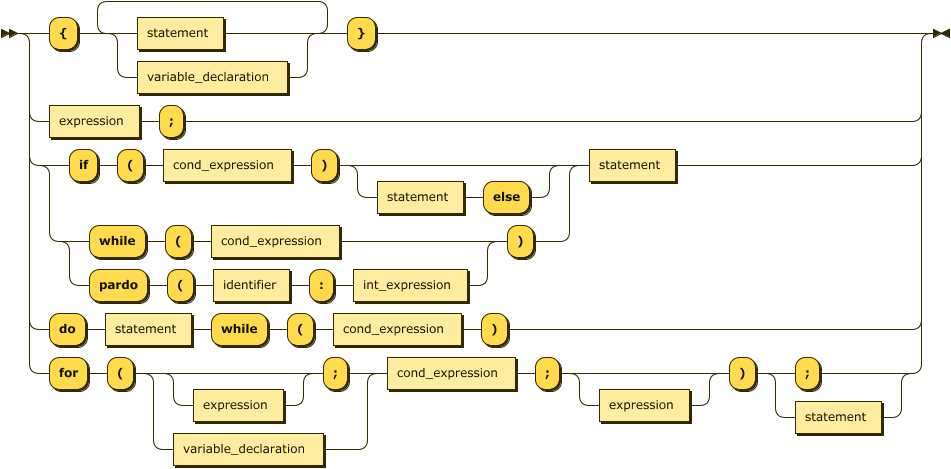
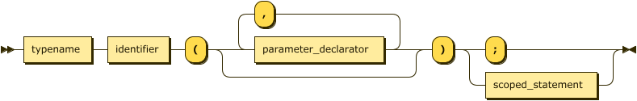
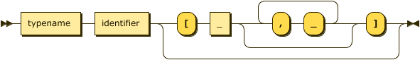
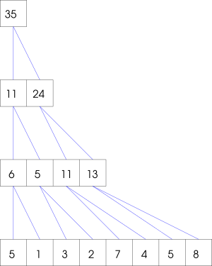

 

# WT\*: a framework for SIMD algorithms design

<h3 style="text-align:center;width:100%;margin-bottom:40px;"><i> 
--- preliminary draft --- 
</i></h3>

WT\* is a framework to study and teach the design of SIMD parallel algorithms. It's
based on the ideas of [Uzi Vishkin](https://dblp.uni-trier.de/pers/hd/v/Vishkin:Uzi),
used also in the book [JáJá: Introduction to Parallel Algorithms](https://www.amazon.com/Introduction-Parallel-Algorithms-Joseph-JaJa/dp/0201548569/ref=sr_1_1).
The aim of WT\* is to provide a hardware-independent programmer-friendly language which
captures the essential properties of parallel programs, yet can be relatively easily mapped to existing hardware-supported languages.

The WT\* programming model consists of a number of threads. The program is started with
one thread, and other threads can be dynamically created and terminated, forming a tree-like
structure of parent-child threads. All threads operate synchronously: they share 
a common code with a single PC (program counter) register. At each instant some group
of threads is *active* and they perform the current operation. 
Each thread can have its own local variables, and can also access all variables of its 
ancestors.
The complexity 
is measured in terms of *time* (the number of consecutive steps) and *work* (the overall number of instructions performed by all active threads).

The WT\* framework consists of a language, a virtual machine, and a set of tools to write and 
execute SIMD programs in an emulated environment.

The structure of this document is as follows:

1. [Usage](#usage)
    * [Live frontend](#web)
    * [CLI tools](#cli)
    * [Building from source](#building)
2. [Description of the language](#language)
    * [Types](#types)
    * [Variables](#variables)
    * [Input and output](#io)
    * [Assignment](#ass)
    * [Expressions](#expressions)
    * [Statements](#statements)
    * [Functions](#functions)
3. [Demos](#demos)    
    * [Factorial](#demo-factorial)
    * [Sum](#demo-sum)
    * [Prefix Sums](#demo-prefix-sums)

## Usage 

### Web interface 

The simplest way to use the framework is via the [live web frontend](./frontend.html)

### CLI tools 

* `wtc` is a compiler from the WT\* language to a binary format
* `wtr` runs the binary (reads input from stdin)

### Building from source 

TODO

[--toc--](#toc)

## Description of the language 

The WT\* provides a simple imperative strongly typed language, with a C-like syntax.

The program is a sequence of type definitions, variable definitions, function definitions,
and statements.

### Types 

There are four basic types: `int`, `float`, `char` (the support for `char` is not yet ready), 
and `void`. User defined types 
(a.k.a. structs, or records) can be created with the `type` keyword by combining
basic and user defined types:

so e.g. this is a valid code:

    type point {
      float x,y;
    } 

    type my_type {
      point p;
      int tag;
    }

### Variables and arrays 

Variables are declared by specifying the type:

The *variable declarator* is in the simplest form the name of the variable, e.g.
`my_type quak;`. 
With several active threads, the variable declaration creates a separate copy of
the variable in each active thread.
The language supports multidimensional arrays. The number of dimensions
is fixed. The size of each
dimension 
must be specified in the declaration. So, e.g. `int B[n,n*n];` declares a 2-dimensional
array `B`.
For arrays, the keyword `dim` gives the number of dimensions, e.g.

    int A[10,20,30], z = A.dim;

results in `z == 3`. The size of the array in a given dimension can be obtained by 
`A.size(d)`; `A.size` is equivalent to `A.size(0)`.

Finally, a scalar variable (assignment to arrays is not supported) that is not 
designated as input, can be 
assigned to during the declaration. The full variable declarator
syntax is as follows:

The initializer can be any expression of compatible type (conversions
among `int` and `float` are performed). Compound types use the bracket 
format, so e.g.,

    type point {
      float x,y;
    }

    type goo {
      point p;
      int a;
    }

    goo gle = { {3.14, -9.6} , 47 };
    
    type ipoint {
      int a,b;
    }

    ipoint p = gle.p;

results in `p == {3, -9}`.

### Input and output 

The input and output is handled by input/output variables. Any variable definition can be 
preceded by the keyword `output` which means the variable is meant to be part of the output. 
The runtime environment is responsible for displaying the output variables. 

Similarly, the input of data is handled by prefixing a variable definition by a keyword 
`input` (at most one of the `input` `output` keywords may be present). Again, the runtime 
environment is responsible for reading the data and initializing the variables. For
obvious reasons, input variables don't support initializers.

A caveat with input arrays is that the size of the array is not known in compile time 
(only the number of dimensions is).
Instead of the size expression, the input arrays use the *don't care* symbol (`_`)
in definition.
Following is a simple program that reads a 1-dimensional array, and returns its size:

    input int A[_];
    output int x = A.size;

The format of input/output variables used by both the cli tools, and the web frontend is
as follows: the static variables of simple types are the respective literals, the
variables of compound types are represented as a flattened list of members enclosed 
in braces, e.g. `output  goo gle = { {3.14, -9.6} , 47 }` would produce
`{ 3.140000 -9.600000 47 }`. Arrays are row-wise bracketed lists of elements,
e.g. the following program

    input int A[_,_];
    int n=A.size(0),m=A.size(1);

on input `[ [ 1 2 3 ]  [ 1 2 3 ] ]` has `n==2` and `m==3`. Whitespace may be added 
arbitrarily.

### Assignment 

Like initializers, assignment is supported only for scalar variables. Unlike initializers,
type checking is more strict: the conversion between `float` and `int` is not performed
in compound types. E.g. consider

    type t1 {int x,y;}
    type t2 {float a,b;}

    t1 var1 = {4,5};
    t2 var2 = {0.1,0.4};

Then `t1 var3 = var2;` is okay, but `var1 = var2` is not; you need to cast the value explicitly
with `var1 = (t1)var2`. Also when assigning literals of compound types, these must be 
typecasted, e.g. `var1 = {9,10};` is wrong, it should be `var1 = (t1){9,10}`.

### Expressions 

|      relational operators     | 
|:-------------:| 
|    ==         |     
|    <=           |     
|    >=           |     
|    !=  |
|<|
|>|

### Statements 

### Functions 

The language supports C-like functions. The return type must be static (i.e. returning
arrays is not allowed). Parameters are passed by value, with the caveat that the 'value'
of an array is the value of the control block (basically, a pointer to the allocated memory).
When passing an array as parameter, the same syntax as with input arrays is used, e.g.
instead of sizes, the *don't care* symbol is used as a placeholder. E.g. a function that
returns the length of an array would be 

    int length ( int A[_] ) {
      return A.size;
    }

It is also possible to have separate definition and declaration (e.g. for mutual
recursion). The full syntax of function definitions is 

where the `parameter_declarator` is

The `return` (for a function returning `void`) or `return <statement>` statement is
used to return from the function.
There are two points concerning returning values: first, if a `return` is issued from
a `pardo` statement, there would be no way to join the threads. Hence, `return` cannot
appear within a pardo statement in a function body. Calling a function from a `pardo`
statement, or having (possibly nested) `pardo` statements in a function 
is perfectly fine, though. The other point is that if the control flow reaches the
end of a function (other than returning `void`) without proper `return` statement,
it
will end up in having the stack filled with some default values, which you probably (surely)
don't want.

[--toc--](#toc)

## Demos 

Here we present some sample programs. They are included also in the web frontend.

### Factorial 

A simple demo of a sequential recursive function computing the factorial 
`n! = 1.2.3.4....n`.

    input int n;
    output int x;

    int fact(int n) {
      if (n == 1)
        return n;
      else
        return n * fact(n - 1);
    }

    x = fact(n);

### Sum 

The task is to compute the sum of an array of integers. The simplest sequential way
is as follows:

    input int A[_];
    output int sum = 0;

    for (int i = 0; i < A.size; i++)
        sum += A[i];

This has linear time and work. We can do better using parallelism:

    input int A[_];
    int n = A.size;
    int Y[n];

    output int sum;

    pardo(i : n) Y[i] = A[i];

    for (int t = 0; 2 ^ t < n; t++)
      pardo(i : n / 2 ^ (t + 1))
        Y[i] = Y[2 * i] + Y[2 * i + 1];

    sum = Y[0];

The program first copies the input array `A` to an auxiliary array `Y`. Then it proceeds in 
`log n` iterations; in each iteration the pairs of consecutive elements are added in parallel
as follows:

Hence, the work is still linear, but the time is only logarithmic.

### Prefix Sums 

The task is produce, given an input array `A` of integers, a new array `B` such 
that the `i`-th element in `B` is the sum of the first `i` elements in `A`. A simple
sequential implementation is as follows:

    input int A[_];
    int n = A.size;
    output int S[n];

    S[0] = A[0];

    for (int i = 1; i < n; i++)
        S[i] = S[i - 1] + A[i];

Both time and work of the previous algorithm are linear. We present two implementation
of parallel version with linear work and logarithmic time. The first one is a recursive
procedure:

    input int A[_];
    output int B[A.size];

    int prefix_sums(int A[_], int B[_]) {
        if (A.size == 1) {
          B[0] = A[0];
        return 1;
        }

        int n = A.size / 2;
        int AA[n], BB[n];

        pardo(i : n) AA[i] = A[2 * i] + A[2 * i + 1];

        prefix_sums(AA, BB);

        pardo(i : n) {
            B[2 * i] = BB[i] - A[2 * i + 1];
            B[2 * i + 1] = BB[i];
        }

        return 1;
    }

    prefix_sums(A, B);

The idea is to first collapse the input array by adding consecutive pairs of elements. 
Recursively computing the prefix sums `BB` on the collapsed array `AA`, we get the
prefix sums of all even prefixes of `A`. Then it is easy to fill the odd prefixes
by subtracting the corresponding value from `A`.

Another version is a bottom-up non-recursive algorithm. For clarity, we use an
auxiliary storage `B` with `n log n` elements (`log n` rows and `n` columns). 
Note however, that we use only linearly many elements from `B`, so it is not
hard to rewrite the program such that it uses only linear storage.
The program works in two passes: in the bottom-up pass it adds the consecutive
pairs of elements in each row, and in the top-down pass it fills in
the elements on odd positions.

      input int A[_];
      int n = A.size;

      int ln = 0;
      for (; 2 ^ ln < n; ln++);

      int B[ln + 1, n]; 
      output int S[n];

      pardo(i : n) B[0, i] = A[i];

      for (int t = 0; 2 ^ t < n; t++)
          pardo(i : n / 2 ^ (t + 1))
              B[t + 1, i] = B[t, 2 * i] + B[t, 2 * i + 1];

      for (int t = 0; 2 ^ t < n; t++)
          pardo(i : n / 2 ^ (ln - t)) {
              B[ln - t - 1, 2 * i] = B[ln - t, i] - B[ln - t - 1, 2 * i + 1];
              B[ln - t - 1, 2 * i + 1] = B[ln - t, i];
          }

      pardo(i : n) S[i] = B[0, i];
